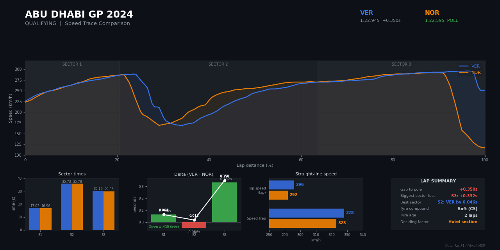

# Pitwall F1

**Turn Claude into your F1 race engineer.** Real telemetry, real strategy data, 75 years of history.

Pitwall F1 is a Claude plugin that bundles an MCP server with 77 read-only tools and an `f1` skill. The skill teaches Claude which tool to use and how to explain Formula 1 to someone watching their first race.



> **Unofficial project.** Pitwall F1 is not affiliated with, endorsed by, or connected to Formula 1, the FIA, Formula One Management, or any F1 team. F1, FORMULA 1 and related marks are trademarks of Formula One Licensing B.V.

## What you can ask

- "Who won the 2025 Australian GP?"
- "What was Verstappen's speed on lap 25 at Monaco?"
- "Plot Hamilton vs Norris speed trace in qualifying"
- "Compare Ferrari's tyre strategy at Silverstone"
- "Who won the 1994 championship?"
- "Who's leading right now, and what's the gap?" (during a live session)

## What's inside

- **Results and classification**: race, sprint and qualifying results, grid vs finish, DNFs, penalties
- **Timing and telemetry**: lap times, sector times, speed traps, and 4 Hz telemetry (speed, RPM, throttle, brake, gear)
- **Strategy**: tyre stints, compounds, pit stops, long-run pace, undercut analysis
- **Plots**: speed traces, gear shift maps and multi-lap comparisons, returned as PNG images drawn locally with matplotlib
- **History**: race results and championships back to 1950
- **Live timing**: 16 tools for positions, gaps, tyres, flags and weather while a session is running

Every tool is read-only and carries a `readOnlyHint` annotation. None of them need an account, a login or an API key.

## Install

Requires [uv](https://docs.astral.sh/uv/getting-started/installation/).

```
/plugin marketplace add darshjoshi/pitwall-f1
/plugin install pitwall-f1@pitwall-f1
```

Or install it from the Claude directory once it's listed.

## What the plugin runs

The plugin starts one local MCP server over stdio:

```
uv run --locked --project ${CLAUDE_PLUGIN_ROOT} ${CLAUDE_PLUGIN_ROOT}/pitwall.py
```

On first start, `uv` installs the exact dependency versions recorded in `uv.lock` (FastF1, pandas, numpy, matplotlib, the MCP SDK and a few HTTP libraries) from PyPI into a virtual environment inside the plugin folder. It takes about 25 seconds and roughly 540 MB. Later starts take under a second.

All server code is in this repository as readable Python: `pitwall.py` (the tools), `signalr_client.py`, `merger.py`, `decompressor.py` and `topics.py` (the live-timing client).

## Network access

Pitwall F1 only makes outbound requests to fetch public F1 data. It sends each service only the parameters of the request (season, event, session), never your conversation, files or any personal data.

| Host | Why |
|------|-----|
| `livetiming.formula1.com` (HTTPS and WSS) | Session timing archive (2018 onward) and the public live-timing feed |
| `api.jolpi.ca` | Historical results and standings from 1950 (the Ergast-compatible Jolpica API) |
| `livetiming-mirror.fastf1.dev` | FastF1's mirror of the timing archive, used as a fallback |
| `api.formula1.com`, `raw.githubusercontent.com` | Season schedule, as fetched by FastF1 |
| `api.multiviewer.app` | Circuit corner and layout data, as fetched by FastF1 |
| `pypi.org`, `files.pythonhosted.org` | Dependency install by `uv` on first start |

The plugin doesn't use F1 TV or any login. Live car telemetry and GPS positions need an F1 TV subscription upstream, so this edition doesn't offer them.

## Privacy Policy

**Data collection.** Pitwall F1 collects no personal data. It has no accounts, analytics, telemetry or crash reporting, and it doesn't read Claude's memory, chat history or your files.

**Usage and storage.** Tool inputs (such as a year, race name or driver code) are used only to build requests to the hosts listed under [Network access](#network-access). Downloaded F1 data is cached on your machine at `~/.cache/pitwall-f1` (override it with `PITWALL_CACHE_DIR`) so repeat questions are fast. Nothing is stored anywhere else.

**Third-party sharing.** Nothing is shared with the author or any other party. The public data services listed above receive the request parameters needed to return F1 data, under their own privacy policies.

**Data retention.** The local cache stays until you delete it. Removing the folder is always safe. Nothing is retained off your machine.

**Contact.** Questions or concerns: contact@darshjoshi.com, or open an issue at https://github.com/darshjoshi/pitwall-f1/issues.

## Known limits

- Detailed timing and telemetry cover 2018 onward. Results before 2018 come from Jolpica and have no lap data.
- Full data for a session is published about 30 minutes after it ends.
- Live tools only return data while a session is running. Otherwise they say so.
- The first start downloads about 540 MB of dependencies.

## Support

Open an issue at https://github.com/darshjoshi/pitwall-f1/issues or email contact@darshjoshi.com.

## License

MIT. See [LICENSE](LICENSE).
